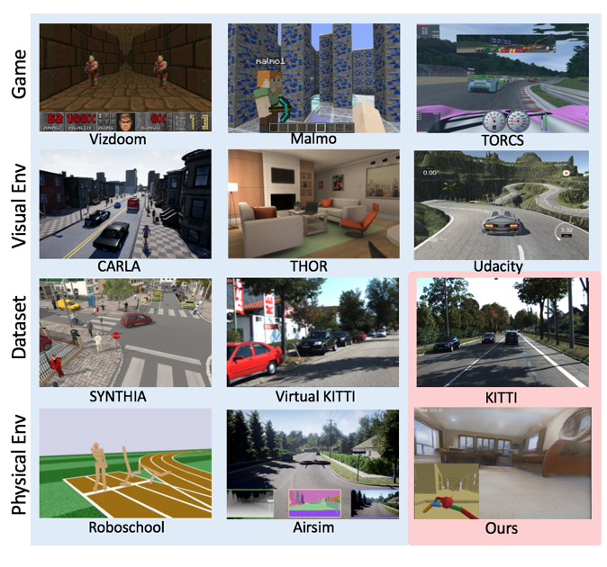

Gibson Env介绍
==========
很高兴给大家介绍我们CVPR2018年的工作Gibson，这是一个主要适用于机器人导航任务的模拟平台。我们工作的主要创新点是抛弃了传统的图形学渲染管线，而使用神经网络作为渲染引擎，并且通过实验证明了这样更容易域迁移(Domain Adaptation)到真实环境。在这篇文章中，我将会用通俗易懂的语言简单介绍我们的环境。

[[项目地址]](http://gibson.vision)  [[论文]](http://gibson.vision/Gibson_CVPR2018.pdf) [[Github地址]](https://github.com/StanfordVL/GibsonEnv) [[视频介绍(英文)]](https://www.youtube.com/watch?v=KdxuZjemyjc)

## 背景

2016年起，伴随深度强化学习的兴起，计算机视觉领域开始出现大量的仿真模拟平台，“数据集”这个概念几乎被重新定义了。计算机视觉和机器人领域中一个很重要的问题是端到端控制(end to end control/sensorimotor control)，即输入为传感器信息，输出直接为控制信号。一个简单的例子是自动驾驶，给定摄像头拍到的画面，希望预测方向盘的转角和油门刹车；或者是在机器人导航中，给定一张输入图片和一个目标，输出下一步需要去的坐标。这样的任务无法在静态的数据集中学习，为了研究这些任务，研究者们搭建了很多这样的模拟环境。

 

这张图概括了一些目前已经有的环境，那么既然已经有了这么多模拟环境，为什么我们还要自己搭建一个呢？在目前已有的环境中，很多都是基于游戏搭建的，当我们在游戏中训练一个agent之后在真实环境中测试的，策略网络会因为渲染引擎产生的像素和真实环境中观测到的像素不同而导致结果不理想。例如在侠盗猎车手中训练的自动驾驶汽车到了真实世界中大概会成为马路杀手。目前大部分的模拟平台都是基于计算机图形学的方法，例如在Unity里参照真实环境构建一个环境(例如THOR, CHALET)，也有的工作构建了自己的环境和渲染引擎(例如House3D, MINOS和Carla)。使用计算机图形学方法渲染的环境通常很难迁移到真实环境，因为渲染不够photorealistic。在我们的工作中，我们使用基于图片的渲染(IBR)方法，达到了高效和真实的渲染。

## 数据集

我们使用从真实环境中获得的3D扫描作为数据集来进行渲染。一个典型的数据集是[2D3DS](http://buildingparser.stanford.edu/dataset.html)。
2D3DS包含6个建筑物，Gibson使用的数据集在此基础上进行了延伸，一共包含572个建筑物和1440层。相比与类似的数据集matterport3D，我们的数据集大约多一个数量级。

## 方法

## 讨论

## ROS demo

